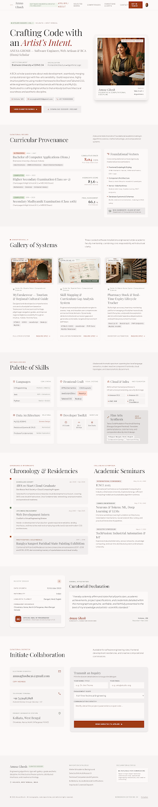

# Anusa Ghosh — Portfolio

A responsive personal portfolio website for **Anusa Ghosh**, Software Engineer & Creative Technologist (BCA Hons scholar at Brainware University, Kolkata).

Built with **React 19 + Vite 8 + Tailwind CSS v4**, styled with a warm **"Atelier" museum aesthetic** — Playfair Display headings, Inter labels, Plus Jakarta Sans body text, and Material Symbols icons.

---

## Screenshots

| Portfolio Landing |
|:---:|
|  |

---

## Live Demo

> **[View Live Portfolio](https://anusa-ghosh-agg.vercel.app)**

---

## Features

- **Animated Loading Screen** — Monogram logo with rotating progress ring, letter-by-letter name reveal, and loader bar animation
- **Always-Solid Sticky Navigation** — Active-section tracking via IntersectionObserver; desktop top nav + mobile side drawer + mobile bottom bar
- **Hero Section** — Profile card with portrait, CTA buttons ("View Exhibited Works" / "Download CV"), institution & merit info
- **Curricular Provenance (About)** — Education timeline (BCA Hons, HS, Madhyamik) with CGPA/scores, foundational vectors panel
- **Projects Gallery** — 3 academic projects displayed as cards with images, tech tags, faculty guide info, and catalog numbers
- **Technical Skills Matrix** — 6 categorized skill cards: Languages, Web Dev, Cloud/AWS, Database, Developer Toolkit, Soft Skills
- **Experience & Internships Timeline** — Vertical timeline with AWS re/Start, CodSoft internship, painting competition awards
- **Academic Seminars & Certificates** — ICSCI 2025, ML/DL workshop, TechFusion seminar, TCS iON, Wadhwani Foundation certificates
- **Curatorial Declaration** — Formal attestation section with personal details (gender, nationality, languages)
- **Contact Section** — Email (with copy-to-clipboard), phone, location, social links (GitHub, LinkedIn), contact form with honeypot spam protection
- **Footer** — Navigation catalogue, digital coordinates, social icons

---

## Tech Stack

| Category | Technology |
|---|---|
| **Framework** | React 19.2 |
| **Build Tool** | Vite 8.2 |
| **Styling** | Tailwind CSS 4.3 |
| **Animation** | Framer Motion 13.2 |
| **Icons** | Material Symbols Outlined (Google Fonts) |
| **Fonts** | Playfair Display, Inter, Plus Jakarta Sans |

---

## Project Structure

```
ANUSA GHOSH/
├── public/
│   ├── Anusa-Ghosh-CV.docx          # Downloadable CV
│   ├── img.png                       # Profile portrait
│   └── robots.txt                    # SEO crawl rules
├── screenshots/                      # README preview images
│   ├── portfolio-full.png
│   ├── monogram-logo.png
│   ├── hero-section.png
│   ├── profile-photo.jpeg
│   ├── portfolio-stitch.png
│   ├── monogram-stitch.png
│   └── portrait-stitch.png
├── src/
│   ├── components/
│   │   ├── Navbar.jsx                # Sticky nav + mobile drawer + bottom bar
│   │   ├── Hero.jsx                  # Landing hero with profile card
│   │   ├── About.jsx                 # Education & curriculum section
│   │   ├── Projects.jsx              # Project gallery cards
│   │   ├── Skills.jsx                # Technical skills matrix
│   │   ├── Experience.jsx            # Internships, seminars, certificates
│   │   ├── Declaration.jsx           # Formal attestation section
│   │   ├── Contact.jsx               # Contact form + details
│   │   └── Footer.jsx                # Site footer
│   ├── secure/
│   │   └── contact.js                # Obfuscated contact details
│   ├── index.css                     # Tailwind theme tokens (warm palette)
│   ├── App.jsx                       # Root app + loading screen
│   └── main.jsx                      # Entry point
├── index.html                        # HTML shell with security headers
├── vite.config.js                    # Vite + React + Tailwind plugins
├── package.json
└── package-lock.json
```

---

## Getting Started

### Prerequisites

- **Node.js** >= 18.x
- **npm** >= 9.x

### Installation

```bash
# Clone the repository
git clone https://github.com/RAZERBOY786/ANUSA-GHOSH-POL.git

# Navigate to project directory
cd ANUSA-GHOSH-POL

# Install dependencies
npm install

# Start development server
npm run dev
```

### Available Scripts

| Command | Description |
|---|---|
| `npm run dev` | Start Vite dev server (default: http://localhost:5173) |
| `npm run build` | Production build to `dist/` folder |
| `npm run preview` | Preview production build locally |

---

## Sections Breakdown

### 1. Loading Screen
Animated intro with spinning ring, "AG" monogram, letter-by-letter name animation, and a progress loader bar. Fades out after 3 seconds.

### 2. Navigation
- **Desktop:** Horizontal top bar with section links and active-section highlighting
- **Mobile:** Hamburger menu opens a side drawer; also has a sticky bottom tab bar with icons

### 3. Hero (`#atelier`)
Full-width hero with headline "Crafting Code with an Artist's Intent", profile portrait card, institution info (Brainware University, CGPA 8.01), and CTA buttons for projects and CV download.

### 4. About / Provenance (`#provenance`)
Education cards:
- **BCA (Hons)** — Brainware University, CGPA 8.01 (In Progress)
- **Higher Secondary** — 83.6% (Completed)
- **Secondary Madhyamik** — 66.1% (Completed)

Plus a "Foundational Vectors" sidebar listing core curricula (HTML/CSS/JS, React.js, Node.js, DBMS).

### 5. Projects (`#selected-works`)
Three academic projects:
1. **MyTarakeswar** — Tourism & guide application (HTML, CSS, JS, Node.js, MySQL)
2. **Skill Mapping & Gap Analysis System** — User skill assessment (HTML, CSS, JS, PHP, MySQL)
3. **Pharmacy Stock & Expiry Tracker** — Medicine inventory system (React.js, Bootstrap, PHP, MySQL)

### 6. Skills (`#competencies`)
Six skill categories:
- **Languages:** C, Java, Python
- **Web Dev:** HTML, CSS, JavaScript, React.js, Node.js
- **Cloud/AWS:** EC2, S3, IAM, VPC, CloudWatch
- **Database:** MySQL, CRUD Operations, Schema Design
- **Dev Toolkit:** VS Code, Chrome, DBMS
- **Soft Skills:** Bengali/Hindi/English, Team Work, Report Writing

### 7. Experience (`#chronology`)
- AWS re/Start Graduate (Don Bosco Tech, Jan–Apr 2026)
- Web Development Intern at CodSoft (Aug–Sep 2025)
- 1st Position in Bangiya Sangeet Parishad State Painting Exhibition (2017–2019)
- Academic seminars: ICSCI 2025, ML/DL Workshop, TechFusion IoT Seminar
- Certificates: TCS iON, Circuit Craft 2K24, Wadhwani Foundation

### 8. Declaration (`#declaration`)
Formal attestation with personal details (gender, nationality, languages, location) and a signed declaration statement.

### 9. Contact (`#contact`)
- Email with copy-to-clipboard
- Phone (IST availability)
- Location (Kolkata, West Bengal)
- GitHub & LinkedIn social links
- Contact form with honeypot spam protection

---

## Security Features

- **Obfuscated Contact Details** — Email and phone are encoded at rest and decoded at runtime to reduce automated harvesting
- **Honeypot Form Protection** — Hidden input field traps bot submissions
- **Security Headers:**
  - `Content-Security-Policy` — Restricts script/style/font/image sources
  - `X-Frame-Options: DENY` — Prevents clickjacking
  - `X-Content-Type-Options: nosniff` — Prevents MIME sniffing
  - `Referrer-Policy: strict-origin-when-cross-origin`
- **robots.txt** — Controls search engine crawl behavior

---

## Design System

The portfolio uses a **warm, museum-inspired "Atelier" color palette** defined via Tailwind CSS v4 theme tokens:

| Token | Color | Usage |
|---|---|---|
| `primary` | `#9f3c16` | Buttons, accents, active states |
| `secondary` | `#546250` | Labels, badges |
| `tertiary` | `#8d4b00` | Highlights |
| `background` | `#fcf9f8` | Page background |
| `surface` | `#fcf9f8` | Card surfaces |
| `surface-container-low` | `#f6f3f2` | Section backgrounds |

**Typography:**
- `font-display` — Playfair Display (headings, hero name)
- `font-sans` — Plus Jakarta Sans (body text, descriptions)
- `font-label` — Inter (labels, badges, uppercase tracking)

---

## Author

**Anusa Ghosh**
- BCA (Hons) Scholar — Brainware University, Kolkata
- Software Engineer & Creative Technologist

| Platform | Link |
|---|---|
| GitHub | [github.com/anusa326](https://github.com/anusa326) |
| LinkedIn | [linkedin.com/in/anusaghosh07](https://www.linkedin.com/in/anusaghosh07/) |

---

## License

This project is proprietary. All intellectual properties and curated works are protected.

---

> Designed & engineered with artistic-scientific precision.
